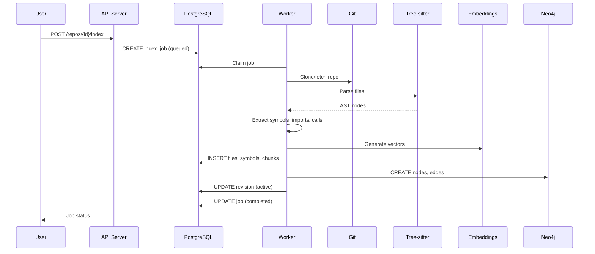
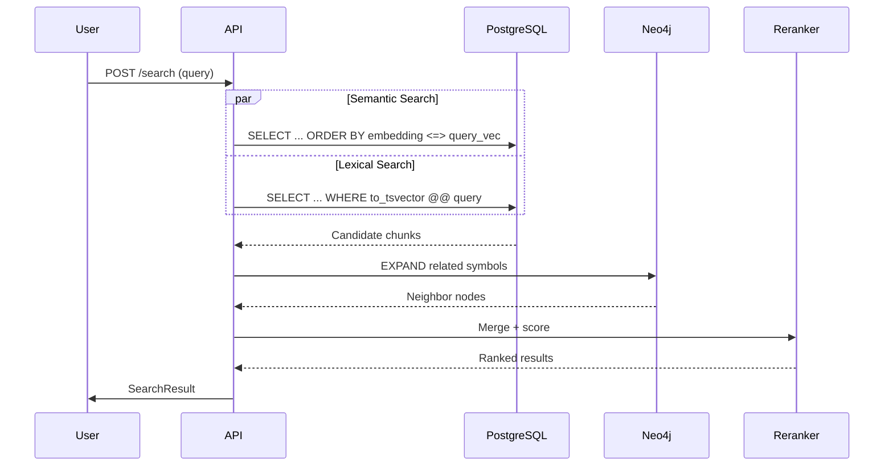
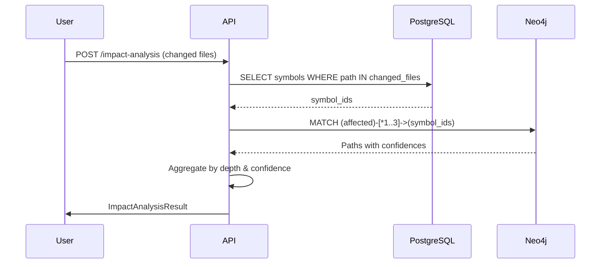

# GitNexus Server Architecture

## Overview

GitNexus Server is a **single-team code intelligence platform** that transforms source code into a queryable knowledge graph. It combines:

- **Graph Database (Neo4j)**: Symbol relationships, call chains, dependencies
- **Vector Database (PostgreSQL + pgvector)**: Semantic code search
- **Tree-sitter Parser**: Multi-language AST extraction
- **MCP Protocol**: AI agent integration (Claude, Cursor, Windsurf)

## Design Principles

1. **Modular Monolith**: Single codebase, clear boundaries, easy to deploy
2. **Dual Database**: Graph for structure, relational for search
3. **Async Indexing**: Background workers handle heavy parsing
4. **MCP-First**: Native AI agent integration
5. **Precomputed Intelligence**: Index-time analysis beats query-time

## System Components

```
┌─────────────────────────────────────────────────────────────┐
│                         CLIENTS                               │
├──────────────┬──────────────────┬─────────────────────────────┤
│  Web Browser │   Claude/Cursor    │   Other AI Tools           │
│   (React)    │   (MCP Protocol)   │   (REST API)               │
└──────────────┴──────────────────┴─────────────────────────────┘
                              │
┌─────────────────────────────────────────────────────────────┐
│                      API LAYER (FastAPI)                      │
│  ┌─────────────┐  ┌─────────────┐  ┌─────────────────────┐  │
│  │ Repos API   │  │ Search API  │  │ Graph API           │  │
│  │ - Create    │  │ - Hybrid    │  │ - Subgraph          │  │
│  │ - Index     │  │ - Semantic  │  │ - Impact            │  │
│  │ - Status    │  │ - Lexical   │  │ - Paths             │  │
│  └─────────────┘  └─────────────┘  └─────────────────────┘  │
└─────────────────────────────────────────────────────────────┘
                              │
┌─────────────────────────────────────────────────────────────┐
│                  DOMAIN LAYER (Python)                      │
│  ┌──────────┐  ┌──────────┐  ┌──────────┐  ┌──────────┐   │
│  │  ingest  │  │  parser  │  │  search  │  │  impact  │   │
│  │  - Git   │  │  - AST   │  │  - vec   │  │  - graph │   │
│  │  - Clone │  │  - Extract│  │  - fts   │  │  - score │   │
│  └──────────┘  └──────────┘  └──────────┘  └──────────┘   │
└─────────────────────────────────────────────────────────────┘
                              │
┌──────────────────────┬──────────────────────────────────────┐
│    POSTGRESQL        │           NEO4J                    │
│  ┌────────────────┐  │  ┌──────────────────────────────┐  │
│  │ repositories   │  │  │ (Repository)-[:HAS_REVISION]│  │
│  │ revisions      │  │  │ (Revision)-[:CONTAINS]       │  │
│  │ files          │  │  │ (File)-[:DEFINES]            │  │
│  │ symbols        │  │  │ (Symbol)-[:CALLS]->(Symbol)  │  │
│  │ chunks + vec   │  │  │ (Symbol)-[:REFERENCES]       │  │
│  │ jobs           │  │  │ (Symbol)-[:INHERITS]         │  │
│  └────────────────┘  │  └──────────────────────────────┘  │
└──────────────────────┴──────────────────────────────────────┘
                              │
┌─────────────────────────────────────────────────────────────┐
│                   INDEXER WORKER                            │
│  1. Clone repo → 2. Parse (Tree-sitter) → 3. Write both DBs │
│  4. Generate embeddings → 5. Mark revision active             │
└─────────────────────────────────────────────────────────────┘
```

## Data Flows

### 1. Repository Indexing Flow



### 2. Search Flow



### 3. Impact Analysis Flow



## Database Schema

### PostgreSQL (Metadata & Search)

```sql
-- Core tables
repositories (id, name, url, status, ...)
revisions (id, repository_id, commit_hash, is_active, ...)
files (id, revision_id, path, language, content, ...)
symbol_spans (id, file_id, name, symbol_type, location, ...)
file_chunks (id, file_id, content, embedding vector(768), ...)
index_jobs (id, repository_id, status, progress, ...)

-- Indexes
CREATE INDEX ON file_chunks USING ivfflat (embedding vector_cosine_ops);
CREATE INDEX ON file_chunks USING GIN (to_tsvector('english', content));
```

### Neo4j (Knowledge Graph)

```cypher
// Node labels
(:Repository {id, name, url})
(:Revision {id, commit_hash, author})
(:File {id, path, language})
(:Symbol {id, name, symbol_type, qualified_name})

// Relationships
(:Repository)-[:HAS_REVISION]->(:Revision)
(:Revision)-[:CONTAINS]->(:File)
(:File)-[:DEFINES]->(:Symbol)
(:Symbol)-[:CALLS {confidence}]->(:Symbol)
(:Symbol)-[:REFERENCES {confidence}]->(:Symbol)
(:Symbol)-[:INHERITS]->(:Symbol)
(:File)-[:IMPORTS]->(:Symbol)
```

## Key Design Decisions

### Why Two Databases?

| PostgreSQL | Neo4j |
|------------|-------|
| Transactional metadata | Graph traversal |
| Vector search (pgvector) | Path queries |
| Full-text search | Pattern matching |
| Job queue | Relationship inference |

**Tradeoff**: Consistency complexity vs. query capability. We use revision-based writes to maintain consistency.

### Why Tree-sitter?

- **Fast**: Incremental parsing
- **Reliable**: Crash-resistant
- **Multi-language**: 40+ grammars
- **Extracts**: Functions, classes, imports, calls

**Limitation**: Syntactic only, not semantic. Call targets may be ambiguous (resolved via heuristics).

### Why MCP Protocol?

- **Standard**: Model Context Protocol from Anthropic
- **Compatible**: Claude Desktop, Cursor, Windsurf, OpenCode
- **Flexible**: SSE, stdio, HTTP transports
- **Extensible**: Easy to add new tools

## Scaling Considerations

### Horizontal Scaling

| Component | Scaling Strategy |
|-----------|------------------|
| API | Multiple instances behind load balancer |
| Worker | Multiple workers, shared job queue |
| PostgreSQL | Read replicas for search |
| Neo4j | Neo4j Cluster (enterprise) |

### Performance Tuning

1. **Indexing**: Parallel workers, batch writes
2. **Search**: IVFFlat indexes, query caching
3. **Graph**: Bounded subgraph queries (never full graph)
4. **Embeddings**: Batch encoding, model caching

## Security Model

1. **Authentication**: API tokens, optional JWT
2. **Authorization**: Repository-level access (future)
3. **Data**: Code stored in your infrastructure
4. **Network**: Internal DBs not exposed
5. **MCP**: Token-based access control

## Monitoring

```
/metrics (Prometheus)
- gitnexus_jobs_total
- gitnexus_indexing_duration_seconds
- gitnexus_search_duration_seconds
- gitnexus_graph_queries_total
- gitnexus_neo4j_connection_status
- gitnexus_postgres_connection_status
```

## Future Extensions

1. **Multi-tenant**: Namespace isolation
2. **Real-time**: WebSocket updates, live indexing
3. **LSP Integration**: Semantic resolution
4. **AI Features**: Auto-summarization, code review
5. **Plugins**: Custom analyzers

## References

- Tree-sitter: https://tree-sitter.github.io/
- Neo4j: https://neo4j.com/
- pgvector: https://github.com/pgvector/pgvector
- MCP: https://modelcontextprotocol.io/
